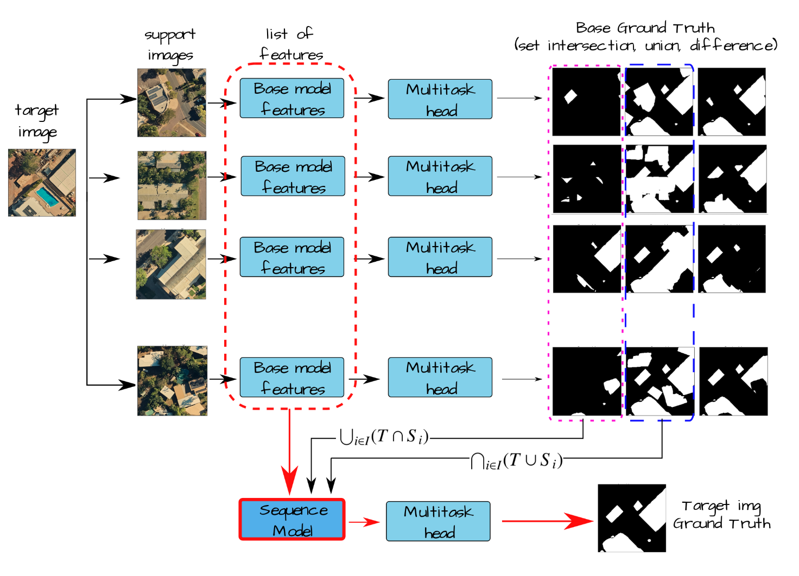

# SSG2: A New Modelling Paradigm for Semantic Segmentation

Official repository for our manuscript [SSG2: A New Modelling Paradigm for Semantic Segmentation](https://arxiv.org/abs/2310.08671)

## SSG2 brief

The core of SSG2 lies in its dual-encoder, single-decoder network, which is further augmented by a sequence model. This unique architecture accepts a target image along with a collection of support images. Unlike traditional approaches that rely on single, static images, SSG2 innovates by introducing a "temporal" dimension through a sequence of observables for each static input image. Within these sequence elements, the base model predicts the set intersection, union, and difference of labels from the dual-input images. This allows for more nuanced and accurate segmentation results. 


The sequence model then takes the reins, synthesizing the final segmentation mask by aggregating these partial views and filtering out noise at each sequence step. The methodology is inspired by techniques in fields like astronomy and MRI, where multiple observations are utilized to enhance data quality. It capitalizes on the strong correlation of true signals and the uncorrelated nature of noise across different sequence elements, offering a potential for statistical filtering and thereby reducing error rates. 


# Data     
Data for the [ISPRS Potsdam and](https://www.isprs.org/education/benchmarks/UrbanSemLab/2d-sem-label-potsdam.aspx) and [ISIC 2018](https://challenge.isic-archive.com/data/#2018) need to be sourced from their official distribution sites due to licensing issues. Currently the internal dataset UrbanMonitor (Darwin, WA), is not provided. 

# Software envinment    
Under location ```ssg2/docker``` exist instructions for both NVIDIA and ROCM Graphics accelerators (ROCM: tested with MI250 on Pawsey Setonix). Containers ready for use can be found on 
+ NVIDIA: docker pull fdiakogiannis/trchprosthesis_requirements:23.04-py3
+ AMD:  docker pull fdiakogiannis/trchprosthesis_requirements:rocm.5.6.latest.12sep2023       
It is recommended to use these containers for your test runs. Alternatively files ssg2/docker/requirements.txt contain all libraries required for running these experiments. 


# License
CSIRO MIT/BSD LICENSE

As a condition of this licence, you agree that where you make any adaptations, modifications, further developments, or additional features available to CSIRO or the public in connection with your access to the Software, you do so on the terms of the BSD 3-Clause Licence template, a copy available at: http://opensource.org/licenses/BSD-3-Clause.


# CITATION 

If you find this work / part of this work please star our repo and cite our work: 
```
@misc{diakogiannis2023ssg2,
      title={SSG2: A new modelling paradigm for semantic segmentation}, 
      author={Foivos I. Diakogiannis and Suzanne Furby and Peter Caccetta and Xiaoliang Wu and Rodrigo Ibata and Ondrej Hlinka and John Taylor},
      year={2023},
      eprint={2310.08671},
      archivePrefix={arXiv},
      primaryClass={cs.CV}
}
```
